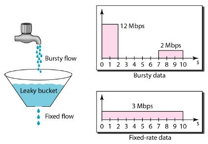
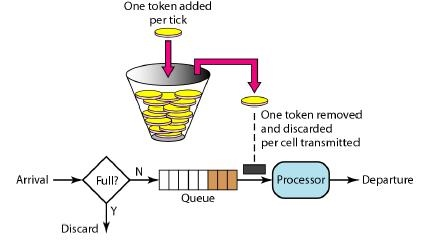

# 1.简介
限流顾名思义是限制流量，限制流量的目的是为了保障服务稳定运行，避免服务被流量冲垮。当流量超出服务处理能力时，部分请求将会被限流组件拦截。被拦截的请求可能会被丢弃，如果是 C 端请求，那么这个请求可能会被导向指定的错误页上，而不是生硬的拒绝。这里我们丢弃掉一部分请求，以保证大部分请求可以正常响应。如果我们不这样做，那么服务崩溃后，所有请求都将无法响应了。当一台机器崩溃后，该机器的所有流量将由其他机器承担，这样就会造成剩余机器压力增大，进而导致奔溃，最后形成雪崩。除此之外，服务崩溃还会造成数据不一致的严重问题，特别是一些敏感数据。比如对于电商网站，如果后台服务准备将某笔订单数据存入数据库时，服务突然崩溃，导致数据没有落库。这个时候，开发同学就要想办法修订数据了。
综上，我们可以看出来限流的重要性。接下来，我将向大家介绍三种常用的限流算法，分别是计数器、漏桶算法和令牌桶算法。下面我们从最简单的计数器开始说起。
 
# 2.限流算法
## 2.1 计数器

计数器算法的思想很简单，每当一个请求到来时，我们就将计数器加一，当计数器数值超过阈值后，就拒绝余下请求。一秒钟后，我们将计数器清零，开始新一轮的计数。计数器算法简单粗暴，易于实现。但是缺点也是有的，也就是所谓的"突刺现象"。举例说明一下，假如我们给计数器设置的阈值为100。系统瞬间内（比如10毫秒内）有200个请求到来，这个时候计数器只能放过其中的100个请求，余下的100个请求全部被拒绝掉。如果第二秒内没有请求到来，那么系统就处于空闲状态。也就是上一秒忙的要死，这一秒又闲的要死。如果我们能用一个容器将剩余的100个请求缓存起来，待计数器重置后再将这些请求放出来。这样系统在这两秒内的吞吐量就由100变成了200，提升了一倍。基于这个思考，下面我们再来看看漏桶算法。

## 2.2 漏桶算法

漏桶算法由流量容器、流量入口和出口组成。其中流量出口流速即为我们期望的限速值，比如 100 QPS。漏桶算法除了具备限流能力，还具备流量整型功能。下面我们通过一张图来了解漏桶算法。

如上图，流入漏桶流量的流速是不恒定的，经过漏桶限速后，流出流量的速度是恒定的。需要说明的是，漏桶的容量是有限的，一旦流入流量超出漏桶容量，这部分流量只能被丢弃了。
漏桶是一个比较好的限流整型工具，不过漏桶不能处理突发流量，一些观点认为这是它的一个缺点。不过如果较起真来，我觉得这个缺点是不成立的。毕竟漏桶本就是用来平滑流量的，如果支持突发，那么输出流量反而不平滑了。如果要找一种能够支持突发流量的限流算法，那么令牌桶算法可以满足需求。

## 2.3 令牌桶算法

令牌桶和漏桶颇有几分相似，只不过令牌通里存放的是令牌。它的运行过程是这样的，一个令牌工厂按照设定值定期向令牌桶发放令牌。当令牌桶满了后，多出的令牌会被丢弃掉。每当一个请求到来时，该请求对应的线程会从令牌桶中取令牌。初期由于令牌桶中存放了很多个令牌，因此允许多个请求同时取令牌。当桶中没有令牌后，无法获取到令牌的请求可以丢弃，或者重试。下面我们来看一下的令牌桶示意图：

尽管令牌桶允许突发流量，但突发流量速率 R1 + 限流速率 R2 不能超过系统最大的处理能力 Rt，即 R1 + R2 ≤ Rt,否则会冲垮系统。

# 3.RateLimiter

我们可以使用 Guava 的 RateLimiter 来实现基于令牌桶的流量控制。RateLimiter 令牌桶算法的单桶实现,RateLimiter 对简单的令牌桶算法做了一些工程上的优化，具体的实现是 SmoothBursty。需要注意的是，RateLimiter 的另一个实现 SmoothWarmingUp，就不是令牌桶了，而是漏桶算法。

SmoothBursty 有一个可以放 N 个时间窗口产生的令牌的桶，系统空闲的时候令牌就一直攒着，最好情况下可以扛 N 倍于限流值的高峰而不影响后续请求,就像三峡大坝一样能扛千年一遇的洪水.

